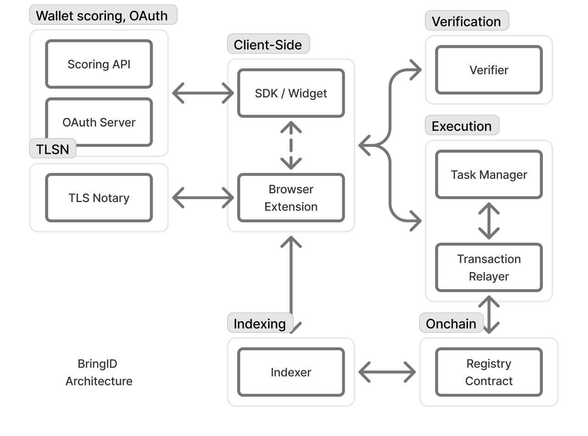

# BringID – Technical Description

Initially, BringID started with zkTLS verifications and added Semaphore on top to achieve maximum onchain privacy. More details can be found in our whitepaper: https://github.com/BringID/whitepaper/blob/main/whitepaper.md

In the current version, we have added OAuth-based verifications as an alternative to zkTLS. OAuth is limited to the data that platforms explicitly share, but it does not require end-users to download any additional software.

---

## Verification Flow

1 & 2. Users verify their data via OAuth or zkTLS.
3. A Verifier (a server currently operated by BringID) checks the verification and provides the user with an authorization signature.
4. This signature is used to publish a Semaphore identity commitment to the BringID Registry.
   - Each verification corresponds to a separate Semaphore group.
   - For example:
     - All active GitHub account verifications correspond to one group.
     - High-quality X (Twitter) account verifications correspond to another group.
   - Each identity commitment corresponds to a Semaphore key under user control.
5. When a user needs to prove their humanity, they generate Semaphore proofs for each completed verification.
   - Applications consuming humanity proofs can verify them against the BringID Registry.
   - Each proof corresponds to a specific Semaphore group.
   - Each Semaphore group has an assigned number of humanity points.
   - Applications can sum the humanity points associated with all provided proofs.

---

## Privacy Guarantees

BringID provides onchain privacy at two layers:

1. **Pre-onchain hashing**
   - Before publishing an identity commitment onchain, the Verifier hashes the account ID with the Verifier's private key.
   - Currently, the Verifier is centralized and trusted.
   - We plan to move toward a more trustless approach in the future: https://curryrasul.com/blog/web2-nullifiers/

2. **Zero-knowledge group membership**
   - BringID uses **Semaphore**, a zero-knowledge protocol that allows users to prove group membership without revealing their original identity.
   - More details: https://github.com/BringID/whitepaper/blob/main/whitepaper.md#privacy-guarantees

---

## BringID Architecture

- **SDK**: wraps BringID processes of wallet address and OAuth verifications & handles Widget behaviour.
- **Browser Extension**: participates in TLSN Verifications on the client side.
- **Scoring API**: scores wallet address based on its onchain history.
- **OAuth Server**: authorizes a user via one of the providers and runs account checks.
- **TLS Notary**: participates in MPC with Browser Extension and notarizes a TLS session.
- **Verifier**: verifies OAuth and TLSN data. Runs checks and signs a message that allows adding Semaphore Commitment later.
- **Task Manager**: Queues and initiates all on-chain operations.
- **Transaction Relayer**: Runs on-chain transactions to cover fees.
- **Registry Contract**: Stores Identity Commitments, verifies Semaphore Proof.
- **Indexer**: Indexes blockchain to make on-chain data available for all other components.
